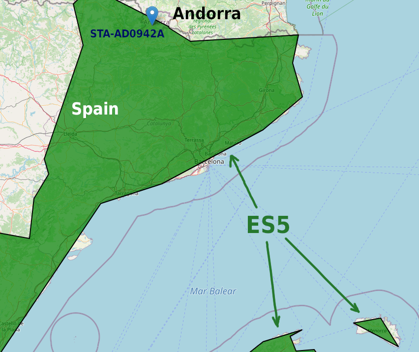
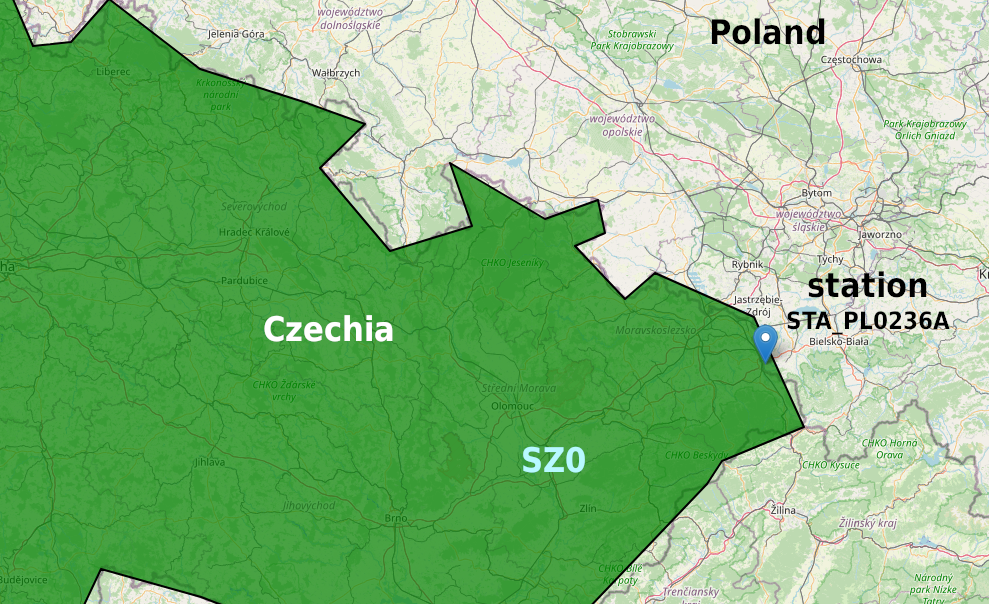

# nra-tst

The project contains Spark jobs that demonstrate certain processing of geospatial data, using free data sources:

* [EU Statistical Regions boundaries LEVEL 1 as geojson format (Nomenclature of territorial units for statistics)](https://datahub.io/core/geo-nuts-administrative-boundaries#resource-nuts_rg_60m_2013_lvl_1)
* [The European Air quality report (Air quality statistics calculated by the EEA)](http://aidef.apps.eea.europa.eu/?source=%7B%22query%22%3A%7B%22match_all%22%3A%7B%7D%7D%2C%22display_type%22%3A%22tabular%22%7D)

Additional meta data information (Not mandatory for the task but it helps better understanding the datasource)

* More about EU Statistical Regions: https://ec.europa.eu/eurostat/web/nuts/background
* More EU air quality stats: https://www.eea.europa.eu/data-and-maps/data/aqereporting-8

Spark jobs do following:

* For each EU statistical region ( NUTS_ID column in EU Statistical Regions boundaries dataset), calculate:
  avg, min, max of AQValue ( from European Air quality report ) for "Carbon monoxide (air)" pollutant in year 2019
* For each country, Find the EU statistical region with the fifth highest average of Carbon monoxide (air)
  emissions for year 2019.
* Find which EU statistical region had the biggest reduction of average CO emissions
  for year 2019 compared to the previous year - 2018.

Requirements:

* In case of missing air statistical data for EU statistical regions the regions should be excluded from the reports
* All the data with data coverage bellow 90% should be discarded
* All the data that is not valid and not verified should be excluded from the reports

## Data accuracy

Note that regions border are not fully accurate according to the countries borders.

E.g. the ES5 is assumed to be the region that belongs to Spain, but because of how rough it's borders are defined,
it touches Andorra. And the air quality data contains data points with coordinates that belong to ES5 region, but were actually measured in Andorra.



Same situation with CZ0 region that covers Czechia but touches Poland.



## Running jobs

### Pre-requireties

You will need to have installed:

* JDK 8+
* Distribution of [Spark 3.2](https://spark.apache.org/downloads.html)
* [SBT](https://www.scala-sbt.org/download.html)

Also will need to download the data.
Use links above to download *EU Statistical Regions boundaries LEVEL 1* and *The European Air quality report*.

Note that *EU Statistical Regions boundaries LEVEL 1* is distributed in GeoJSON format, but the job expects it in WKT format.
That's why you will have to convert regions boundaries data to WKT format using [this](https://mygeodata.cloud/converter/geojson-to-wkt)
service, or any other tool you prefer.

### Build

The application artifact is represented by a fat jar, that contains all the libraries and resources.

In console:

* Navigate to the project folder
* execute `sbt assembly`
* you should have the artifact located in `target/scala-2.12/nra-tst-assembly-0.1.0-SNAPSHOT.jar`

### Run

To see how everything works you can run the Spark job using command:

```shell
$SPARK_HOME/bin/spark-submit \
  --class snorochevskiy.tst.nra.CarbonMonoxideReportJob \
  /path/to/nra-tst-assembly-0.1.0-SNAPSHOT.jar /path/to/regions_data.csv /path/to/air_quality_data.csv
```

Alternatively, you can just run `snorochevskiy.tst.nra.CarbonMonoxideReportJobIdeRun` from the IDE.
It will run the job on prefiltered subset of air quality data that is made of original data set by filtering out
non valid and carbon monoxide data.

## Results

Min, Max, Avg Carbon monoxide by region:

```
+------------------+-------+-------------------+-------------+-------------+
|CountryOrTerritory|NUTS_ID|avg_pollution      |min_pollution|max_pollution|
+------------------+-------+-------------------+-------------+-------------+
|Andorra           |ES5    |0.550931326        |0.270993     |1.1          |
|Austria           |AT1    |0.5303017543749999 |0.08461514   |1.78984999   |
|Austria           |AT2    |0.8928781690243902 |0.06633949   |7.74087047   |
|Austria           |AT3    |0.769835814927536  |0.01751049   |3.53940009   |
|Belgium           |BE2    |0.7097107352500001 |0.035        |3.38499999   |
|Belgium           |BE3    |0.516499618148148  |0.075        |4.94         |
|Bulgaria          |BG3    |1.3665842297560977 |0.03         |7.63999999   |
|Bulgaria          |BG4    |2.0370867474418604 |0.04         |6.82         |
|Croatia           |HR0    |0.9254376623809523 |0.054        |3.50999999   |
|Cyprus            |CY0    |1.0070301153333334 |0.15063      |3.906384     |
|Czechia           |CZ0    |0.918809447529412  |0.0195       |7.7290006    |
|Denmark           |DK0    |0.5583173158620689 |0.052        |2.69899999   |
|Estonia           |EE0    |0.4693009865853657 |0.08         |2.14999999   |
|Finland           |FI1    |0.17312251499999998|0.0884       |0.2703       |
|France            |FR1    |0.9310431549999999 |0.056        |2.40099999   |
|France            |FR2    |0.5129956345454546 |0.074        |1.568        |
|France            |FR3    |2.6429615440000003 |0.188        |9.43099999   |
|France            |FR5    |0.6999975180000001 |0.214        |1.819        |
|France            |FR7    |0.8612102466666666 |0.1          |2.17799999   |
|France            |FR8    |1.27831075         |0.28         |3.737        |
|France            |FRA    |0.7316522360000001 |0.401        |1.44799999   |
|Germany           |DE1    |0.7631989682608694 |0.092        |3.39999999   |
|Germany           |DE2    |16.579988589529414 |0.09595056   |64.62        |
|Germany           |DE3    |0.7049334941666666 |0.12         |1.95         |
|Germany           |DE4    |0.5908115046666667 |0.07         |2.73         |
|Germany           |DE5    |0.6038984304166667 |0.015        |2.31999999   |
|Germany           |DE6    |0.6878657916666667 |0.1          |2.19936      |
|Germany           |DE7    |0.7648909045555552 |0.03493268   |3.44555545   |
|Germany           |DE8    |0.5196879020833333 |0.039        |1.96         |
|Germany           |DE9    |0.9024432046511628 |0.017737     |2.7988       |
|Germany           |DEB    |0.6856401737179488 |0.03492      |3.43329381   |
|Germany           |DEC    |1.0711041166666668 |0.11         |4.38999999   |
|Germany           |DEE    |0.7016509225000002 |0.0790074    |4.27700499   |
|Germany           |DEG    |0.5623295983333334 |0.11644      |1.63567221   |
|Greece            |EL3    |1.7229793506250002 |0.1          |5.79999999   |
|Greece            |EL5    |1.3437407233333332 |0.1          |4.9          |
|Greece            |EL6    |1.5027461283333332 |0.2          |3.89999999   |
|Hungary           |HU1    |1.0718385466666664 |0.03         |4.19099999   |
|Hungary           |HU2    |1.313090768333333  |0.032        |5.58024999   |
|Hungary           |HU3    |1.3007551758333336 |0.017        |4.57         |
|Ireland           |IE0    |0.7858249033333332 |0.1          |2.7          |
|Italy             |ITC    |1.1734419806410255 |0.00001      |6.12         |
|Italy             |ITF    |1.2848542100793663 |0.01         |7.79999999   |
|Italy             |ITG    |0.6304669096202532 |0.00165      |3.77635999   |
|Italy             |ITH    |1.0941906591558446 |0.1          |4.93738      |
|Italy             |ITI    |1.2031887092307687 |0.02         |6.09999999   |
|Lithuania         |LT0    |0.9871272299999999 |0.09         |4.98         |
|Luxembourg        |LU0    |0.5442140438888887 |0.09         |2.31         |
|Netherlands       |NL2    |1.1481253280000001 |0.2946       |2.8671       |
|Netherlands       |NL3    |0.8522965600000002 |0.0168       |6.3376       |
|North Macedonia   |MK0    |3.06860763716418   |0.01156929   |9.91074419   |
|Poland            |CZ0    |1.5903816233333334 |0.13161      |5.08758      |
|Poland            |PL1    |1.251635716388889  |0.059        |5.128        |
|Poland            |PL2    |1.475379281071429  |0.01839      |6.57558      |
|Poland            |PL3    |1.2589261533333331 |0.0026       |4.40826999   |
|Poland            |PL4    |0.8278220353333333 |0.00366      |2.81643      |
|Poland            |PL5    |1.0722460447916669 |0.0712       |3.96829      |
|Poland            |PL6    |0.8567121718627452 |0.00201067   |4.00399999   |
|Portugal          |PT1    |1.2539830877777778 |0.057        |5.85299999   |
|Romania           |BG3    |1.5780261966666664 |0.04         |4.83         |
|Romania           |RO1    |1.422810783738317  |0.01         |7.76999999   |
|Romania           |RO2    |1.2574751848913046 |0.01         |8            |
|Romania           |RO3    |1.2805248055833334 |0.01         |5.84999999   |
|Romania           |RO4    |1.4415971134090908 |0.01         |8.42999999   |
|Slovakia          |SK0    |0.8870387464102562 |0.000464     |3.26737      |
|Slovenia          |SI0    |0.8822897842857144 |0.09         |2.62         |
|Spain             |ES1    |0.9026465006341455 |0.05         |9.69999999   |
|Spain             |ES2    |0.6977308275925921 |0.02         |6.75999999   |
|Spain             |ES3    |0.9420384544444446 |0.1          |4.09999999   |
|Spain             |ES4    |0.9203651045238092 |0.05         |7.4          |
|Spain             |ES5    |0.48279232772222225|0.1          |3.89999999   |
|Spain             |ES6    |0.7973159089423079 |0.001        |6.889        |
|Sweden            |SE1    |1.9104278884374994 |0.1          |8.3          |
|Sweden            |SE2    |0.47207844083333333|0.04192307   |1.36863636   |
|Switzerland       |CH0    |0.6276397862962964 |0.0116       |4.36929999   |
|Turkey            |TR1    |1.3155682767857146 |0.006        |6.016        |
|Turkey            |TR2    |2.7805483211111115 |0.036        |9.794        |
|Turkey            |TR3    |1.3276460186666668 |0.001        |8.134        |
|Turkey            |TR4    |2.6191121020000003 |0.001        |9.57         |
|Turkey            |TR5    |3.655672784444444  |0.008        |9.88599999   |
|Turkey            |TR7    |2.005641751818182  |0.002        |7.359        |
|Turkey            |TR8    |2.6023206281578948 |0.001        |7.87549999   |
|Turkey            |TR9    |1.3455987274999999 |0.1          |4.774        |
|Turkey            |TRA    |2.5918400529166665 |0.025        |9.73799999   |
|United Kingdom    |UKE    |0.5189917016666666 |0.037259     |1.50875699   |
|United Kingdom    |UKI    |0.6427727116666667 |0.026636     |1.645519     |
|United Kingdom    |UKL    |1.7585026616666666 |0.014257     |6.25599099   |
+------------------+-------+-------------------+-------------+-------------+
```

Fifth highest average of Carbon monoxide (air) emissions for year 2019

```
+------------------+-------+------------------+
|CountryOrTerritory|NUTS_ID|avg_pollution     |
+------------------+-------+------------------+
|France            |FR1    |0.9310431549999999|
|Germany           |DEB    |0.6856401737179488|
|Italy             |ITF    |1.2848542100793663|
|Poland            |PL3    |1.2589261533333331|
|Romania           |BG3    |1.5780261966666664|
|Spain             |ES4    |0.9203651045238092|
|Turkey            |TRA    |2.5918400529166665|
+------------------+-------+------------------+
```

The region that had the biggest reduction of average CO emissions for year 2019 compared to the previous year - 2018.
```
TR7
```